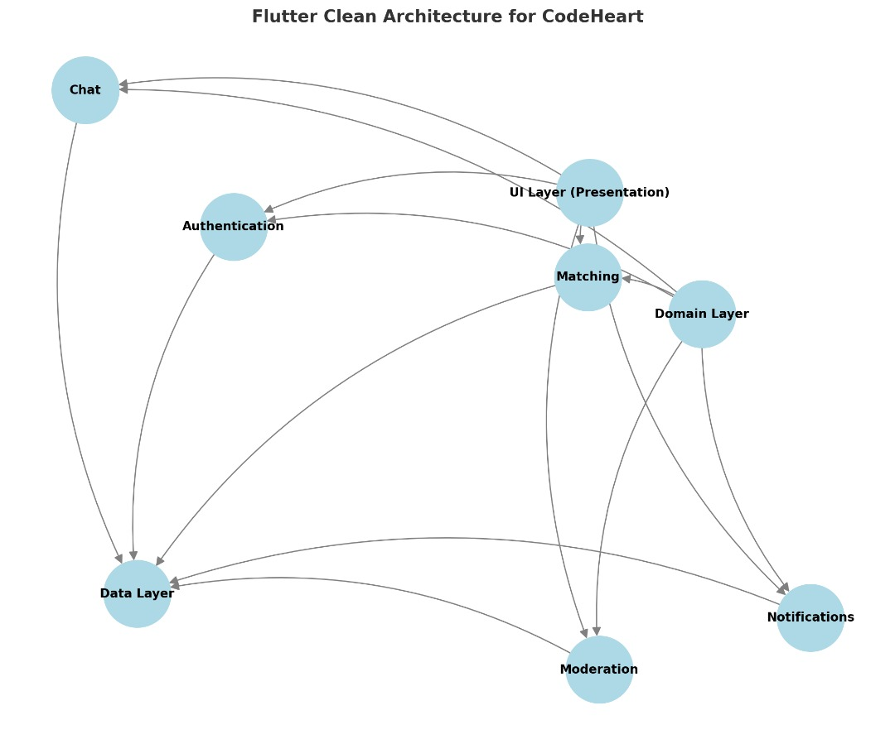

Pour votre projet **CodeHeart**, une architecture bien organisée est essentielle pour gérer efficacement les différentes fonctionnalités (matching, chat, notifications, sécurité). Je propose une architecture **modulaire et scalable** basée sur le modèle **Clean Architecture** adapté pour Flutter. Voici les détails : 

---

### **1. Architecture globale**
#### Clean Architecture
- Divisée en trois couches principales :
  1. **Présentation (UI)** : Gestion des widgets Flutter, logique d'affichage et interaction utilisateur.
  2. **Domaine** : Logique métier indépendante des frameworks (use cases, modèles).
  3. **Données (Data)** : Interactions avec Firebase, API externes, et stockage local.

Cette séparation permet :
- Une **testabilité élevée** (chaque couche peut être testée indépendamment).
- Une **scalabilité** pour ajouter des fonctionnalités futures.
- Un **faible couplage** entre les parties de l’application.

---

### **2. Structure des dossiers**

```plaintext
lib/
├── core/               # Classes utilitaires, thèmes, constantes
├── features/
│   ├── auth/           # Fonctionnalités liées à l'authentification
│   │   ├── data/       # Services Firebase/Auth API
│   │   ├── domain/     # Modèles et use cases (login, signup)
│   │   └── presentation/ # Widgets et écrans d'authentification
│   ├── matching/       # Logique et écrans du matching
│   │   ├── data/       # Appel Firebase/algorithme de matching
│   │   ├── domain/     # Use cases et entités (MatchUser, Preferences)
│   │   └── presentation/ # Écrans de suggestion et détail
│   ├── chat/           # Fonctionnalités de chat
│   ├── notifications/  # Gestion des notifications
│   └── moderation/     # Modération et signalement
├── app.dart            # Initialisation principale de l'application
└── main.dart           # Entrée principale
```

---

### **3. Détails des couches**
#### 3.1 Présentation (UI)
- Contient tous les **widgets** et **pages**.
- Utilise **Provider** ou **Riverpod** pour la gestion de l’état.
- Exemple pour `matching` :
  ```plaintext
  features/matching/presentation/
  ├── pages/
  │   ├── matching_screen.dart
  │   └── match_detail_screen.dart
  └── widgets/
      ├── match_card.dart
      └── filter_widget.dart
  ```

#### 3.2 Domaine
- Contient la logique métier et les cas d'utilisation (*use cases*).
- Exemple : Algorithme de matching
  ```dart
  class FindBestMatch {
    final MatchRepository repository;

    FindBestMatch(this.repository);

    Future<Match> execute(UserPreferences preferences) {
      // Logique pour trouver un utilisateur compatible
      return repository.findMatchingUser(preferences);
    }
  }
  ```

#### 3.3 Données (Data)
- Contient les implémentations pour interagir avec Firebase, API externes et le stockage local.
- Exemple pour Firebase :
  ```plaintext
  features/matching/data/
  ├── datasources/
  │   ├── firebase_matching_service.dart
  └── repositories/
      └── matching_repository_impl.dart
  ```

---

### **4. Firebase Intégration**
#### Services Firebase :
- **Authentication** : Pour créer et gérer les comptes utilisateurs.
- **Cloud Firestore** : Stocker les profils, préférences et historiques de matching.
- **Firebase Storage** : Gérer les photos de profil et les médias partagés.
- **Firebase Cloud Messaging** : Notifications en temps réel.

---

### **5. Gestion de l’état**
Choisissez une bibliothèque de gestion d'état en fonction de votre expérience :
- **Provider** : Simplicité et efficacité pour la plupart des cas.
- **Riverpod** : Plus modulaire et testable.
- **Bloc** : Pour des projets très complexes avec logique d'état détaillée.

---

### **6. Sécurité**
- Implémentez un **backend sécurisé avec Firebase Rules** pour limiter l’accès aux données sensibles.
- Utilisez **Google Cloud Vision API** ou **Microsoft Azure Content Moderator** pour analyser les images et signaler les contenus inappropriés.

---

### **7. Exemple d’un flux de fonctionnalité : Matching**
1. **User opens the app**: L’écran récupère les préférences utilisateur depuis Firebase.
2. **Algorithm finds matches**: Le repository appelle Firebase pour obtenir une liste de profils compatibles.
3. **Display results**: Les résultats sont affichés sous forme de cartes swipeables.
4. **Real-time updates**: Firebase Firestore Stream notifie en temps réel les changements (nouveau match ou modification).

---

### **8. Exemple visuel**
